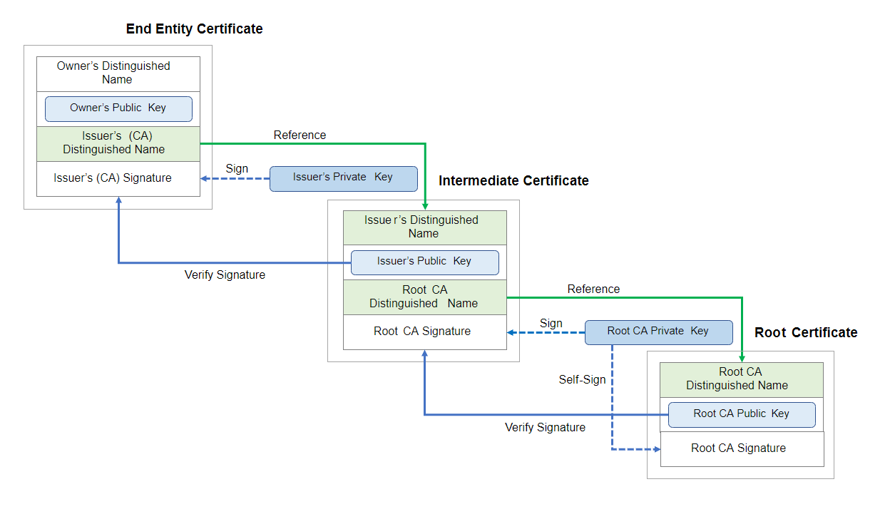
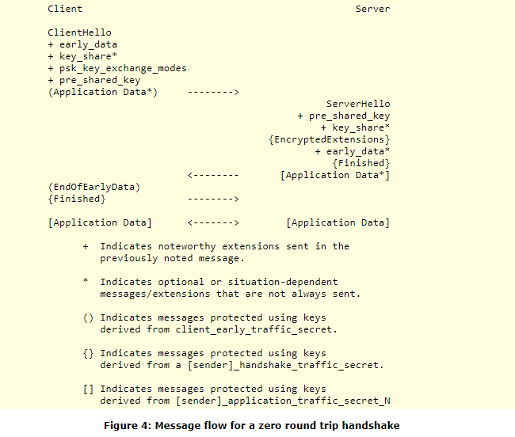

<h1 style="text-align: center;">Web Security 101</h1>

# Table of Contents
1. [HTTPS](#https)
2. [Transport Layer Security](#tls)
3. [Content Security Policies](#csp)
4. [Same-Origin Policy](#sop)
5. [Cross-Origin Resource Sharing](#cors)
6. [HTTP headers](#headers)
7. [Cookies and Web storage](#cookies)
8. [Attacks overview](#attacks)
	- [SSL Stripping](#ssls) 
	- [XSS](#xss)
	- [CSRF](#csrf)
	- [SSRF](#ssrf)
9. [Miscellaneous](#misc)
	- [VPNs](#vpns)
	- [security.txt](#securitytxt)
10. [Other resources](#resources)
11. [Glossary](#glossary)

<br>

# 1. HTTPS <a id="https"></a>
## Definition
> "**HTTPS (Hypertext Transfer Protocol Secure)** is an internet communication protocol that protects the integrity and confidentiality of data between the user's computer and the site.
In HTTPS, the communication protocol is encrypted using Transport Layer Security (**TLS**) or, formerly, Secure Sockets Layer (**SSL**). The protocol is therefore also referred to as HTTP over TLS, or **HTTP over SSL**.
The principal motivations for HTTPS are authentication of the accessed website, and protection of the privacy and integrity of the exchanged data while in transit. It protects against man-in-the-middle attacks, and the bidirectional encryption of communications between a client and server protects the communications against eavesdropping and tampering. In practice, this provides a reasonable assurance that one is communicating with the intended website without interference from attackers." - [wikipedia](https://en.wikipedia.org/wiki/HTTPS)
  
HTTPS provides **end-to-end encryption of traffic** between the client's browser and the server.


## Use cases
* Avoid interception of messages (by someone looking at the traffic)
* Ensure integrity of data (content of the pages can not be modified before arriving to the receiver)
* Protect users privacy
* Authenticate domains (and websites running on those domains) with the help of SSL Certificate Authorities (CA) and SSL certificates
* Faster loading times than HTTP/1.1 (see [HTTP vs HTTPS](https://www.httpvshttps.com/))

HTTPS helps against script injections (cryptominers, keyloggers, ads...), DOM page modification, DNS spoofing, CSRF attacks on routers. These attacks are enabled on HTTP when one gets access to traffic (ex: at a proxy level) where they can see the traffic and inject payloads or modify the page before it reaches the user's browser. HTTPS is necessary even on static web pages, see this video: [Here's Why Your Static Website Needs HTTPS](https://www.youtube.com/watch?v=_BNIkw4Ao9w).

*Note: HTTPS does not mean you can have full trust to the website you are connecting to. It only means your connection is private. It cannot be eavesdropped and its traffic can't be modified by a man in the middle.*
> "HTTPS & SSL doesn't mean "trust this." It means "this is private." You may be having a private conversation with Satan. - [Scott Hanselman tweet](https://twitter.com/shanselman/status/187572289724887041)


## Protocol : TLS
*TLS summarized:* client connects to the server (**handshake** begins) and verifies the authenticity of the server (via its SSL certificate and the help of Certificate Authorities). Client and server then safely agree on a **secure cipher suite** to use for the rest of the communication. Some **shared secrets are exchanged** depending on the cipher suite chosen (handshake ends). Then the rest of the communication is encrypted before being sent and decrypted on reception (for both ends).

See the [**Transport Security Layer (TLS)**](#tls) section for a detailed explanation of the protocol.

### HTTPS configuration
HTTPS is usually configured on the web server hosting the website/application (or the proxy in front of the application, ex: Cloudflare hosting/'proxy'). The web server (nginx/apache/traefik/...) has configuration files that define how it should behave when getting a request or when sending a response. The configuration specifies what protocol the server support (TLS 1.2, TLS 1.3), the cipher suites available, the HTTP(S) ports, the SSL certificate info. The web server can redirect traffic to HTTPS automatically, add security headers to outgoing requests ([HSTS](#hsts), [CSP](#csp), ...). Tools and resources can guide you to generate and verify the configuration of your web server:

* [Mozilla SSL Configurator](https://ssl-config.mozilla.org/) - SSL configuration generator (for nginx/apache/traefik...)
* [Scott Helme HTTPS Cheat Sheet](https://scotthelme.co.uk/https-cheat-sheet/) 
* [SSL Labs](https://www.ssllabs.com/ssltest/index.html) - test your HTTPS config
* [SecurityHeaders.io](https://securityheaders.io/) - test your security headers

**The configuration is key to ensure the security of the application**. A misconfigured server or a server enabling old/discarded protocols/features can compromise the application and the HTTPS connection.

### HTTP/2
  
  > TODO


## HSTS (HTTP Strict Transport Security) <a id="hsts"></a>
* **_Strict-Transport-Security_** HTTP **response header**  
* **How it works**: a **response header** is returned by the server and says 'For the next X seconds (maxAge), the browser may not make an insecure request on this domain. It should be used with [**preloading**](#preload) for maximum security (preload = if the user has never been on the website before, it will ensure it loads over HTTPS even on the first connection, even if the user does not specify https://).
  
By default in browsers, the first request goes through HTTP if HTTPS is not specifically mentionned, and usually the server will return a 301 Redirect to use HTTPS instead. If HSTS is set, then **all the requests after the first one will ensure the use of HTTPS (until maxAge)** even if the user sends an HTTP request (ex: by not specifying https:// or clicking an HTTP link/bookmark). See [RFC#6797](https://tools.ietf.org/html/rfc6797).

*ex: strict-transport-security: max-age=31536000; includeSubDomains; preload*

### More on HSTS

* [Understanding HTTP Strict Transport Security (HSTS) and preloading it into the browser - Troy Hunt](https://www.troyhunt.com/understanding-http-strict-transport/)
* [Scott Helme HSTS Cheat Sheet](https://scotthelme.co.uk/hsts-cheat-sheet/)

> TODO Research about the 'Trust On First Use' problem (TOFU) - is the initial request being secured? Usually (without HSTS and preload), the first connection is insecure and then the connection becomes secure


## Preloading <a id="preload"></a>
Websites that use HSTS and the **preload option** ensure only HTTPS requests can be used between the client and the server (even if the user has never been there before, it will only be loaded over HTTPS no matter what - browser does a 307 Internal Redirect). **Preloaded website lists are embedded directly in browsers binaries** (see [HSTSpreload.org](https://hstspreload.org/) for submissions) and **the browser itself forces the use of HTTPS from the first request**. It should be used for the entire site and its subdomains.

> "However, be aware that inclusion in the preload list cannot easily be undone. Domains can be removed, but it takes months for a change to reach users with a Chrome update. Don't request inclusion for HSTS preloading unless you're sure that you can support HTTPS for your entire site and all its subdomains in the long term." - from [hstspreload.org](https://hstspreload.org/)

* **HSTS + preloading** should be considered the standard for security

Using HSTS and preload option with a website that does not serve everything over HTTPS will completely block users from accessing your website as the browsers will block connections when they see HTTP content (HTTP content is not allowed on HSTS preloaded websites). You need to be cautious when configuring HSTS and preload option and test your entire app before you fully commit and submit your site to the preload list. See [HTTPS is easy - a guide by Troy Hunt](https://httpsiseasy.com/) to get a good understanding on how to configure HTTPS, HSTS and preload option.


## DNS over HTTPS (DoH)
> TODO Research this, see: [wikipedia](https://fr.wikipedia.org/wiki/DNS_over_HTTPS)   
> Option to enable in the browser (exists on Mozilla but not Chrome?)


## More on HTTPS and how to implement it

* [Mozilla guidelines on web security](https://infosec.mozilla.org/guidelines/web_security)
* [Google guidelines on web security](https://developers.google.com/web/fundamentals/security/?hl=en)
* [Does my site need HTTPS?](https://doesmysiteneedhttps.com/)
* [What is an SSL certificate? - Cloudflare](https://www.cloudflare.com/learning/ssl/what-is-an-ssl-certificate/)
* [Let's encrypt FAQ](https://letsencrypt.org/docs/faq/)
* [HTTPS is easy - a guide by Troy Hunt](https://httpsiseasy.com/) - *"Troy Hunt is a Microsoft Regional Director and MVP, web security expert known for public education and outreach on security topics" (wikipedia). He also runs a [blog (troyhunt.com)](https://www.troyhunt.com/) with knowledgeable content about web security and his [Have I Been Pwned](https://haveibeenpwned.com/) project.*
* ["What Every Developer Must Know About HTTPS"](https://www.pluralsight.com/courses/https-every-developer-must-know): Pluralsight course on HTTPS


## Mobile apps
 **Mobile apps** do not have a browser to warn the user if the connection is using HTTPS or not. There is no certificate validatiton insurance either and no padlock to see the HTTPS status (whereas those infos are displayed in browsers). A lot of mobile apps traffic (that is not using a browser) is insecure (using HTTP, sending credentials with HTTP before getting redirected to HTTPS etc).

<br>


# 2. Transport Layer Security (TLS) <a id="tls"></a>

The content in this section mainly comes from the [TLS Mozilla documentation](https://developer.mozilla.org/en-US/docs/Web/Security/Transport_Layer_Security) and the [TLS Wikipedia page](https://en.wikipedia.org/wiki/Transport_Layer_Security).

## Definition and history
Transport Layer Security (**TLS**) protocol is a standard to ensure data encryption between a user-agent and a web server. Its ancestor was the *Secure Sockets Layer* (**SSL** 2.0/3.0) that was released with the HTTP protocol.

In 1999, TLS was introduced by the Internet Engineering Task Force (IETF) to **standardize encryption over HTTP** which became **HTTPS** (for HTTP over SSL/TLS or HTTP Secure). Nowadays, SSL and TLS acronyms both refer to the same secured HTTPS protocol which is the TLS standard (the old SSL protocol is no longer suppported). By default **HTTPS** is running on **port 443** (as opposed to HTTP on port 80).

- TLS 1.0 was released in 1999, TLS 1.1 in 2006 (both are no longer supported as of 2020)
- TLS 1.2 was released in 2008 
- TLS 1.3 was released 2018 ([RFC spec](https://tools.ietf.org/html/rfc8446))

## Use case
HTTP over SSL/TLS for:

* **authentication**: using a [Public key certificate](#sslcert) - "Each party verifies that the other party is who they claimed to be" (although the server does not always verify who the client is)
* **encryption**: the user-agent and the web server agree on a protocol to encrypt all data sent, so it can't be read or intercepted (using symmetric encryption with a shared secret)
* **integrity**: information can't be altered between encryption and decryption (no data loss, no data altered over transmission)
* **privacy**: most of the communication is encrypted (all data is encrypted except some metadata/headers required for the transmission at the network level) which enable users privacy


## SSL certificates <a id="sslcert"></a>

A **[public key certificate](https://en.wikipedia.org/wiki/Public_key_certificate)** (also called _X.509 certificate_, _SSL certificate_ or _digital certificate_) is a document that attest the authenticity of a website/domain. Public key certificates  attest that someone is the owner of a website and that the website is who it claims to be. It provides **authentication** when connecting to a website. A public key certificate contains:

- some info about the **owner** of the website (ex: company name)
- the **public key** of the server

- the **signature algorithm** used by the issuer to sign the certificate
- the **signature of the certificate's body** that was generated by using the issuer's private key
- the reference to the issuer of the certificate (so its public key can be retrieved to **verify the signature**)

### Certificate Authorities
TLS relies on third parties that issue and confirm the **authenticity of certificates** (using certificate **chains of trust**). Root Certificate Authorities issue Intermediate certificates (to other certificate companies) which in turn issue other Intermediate Certificates or End-Entity certificates (for website owners) thus creating a chain of trust with multiple certificates from the root CA to the website certificate. See the schema below representing the chain of trust from root certificate to end entity certificate.


<div style="text-align: center" align="center"><p>Source: <a href="https://en.wikipedia.org/wiki/Public_key_certificate#/media/File:Chain_Of_Trust.svg" target="_blank">Public key certificate wikipedia page</a></i></p></div>

### How do certificates provide authentication?
Certificates use **asymmetric encryption** (public key/private key) [same as encrypted emails]:

- **authenticition** of the website is achieved by trusting the certificate issuer (and the chain of issuers)
- **integrity** of the certificate is ensured via the signature of the certificate's body which is encrypted by the issuer (with its private key) and can be decrypted by anyone using the signature algorithm and the issuer's public key


## TLS 1.2 handshake

The **TLS handshake** is a protocol used to safely create a secure connection between the client and the server. It can be split in 4 parts : **Hello + Cipher suite decision**, **Certificate validation**, (**Key exchange / Session key generation**) and **Finish**.

In TLS 1.2, the **cipher suite** is a set of cryptographic algorithms that together provide:

* the negotiation of the **shared secret**
* the means by which a server is **authenticated**
* and the method that will be used to **encrypt** data

The client connects to the server announcing the cipher suite it can handle. The server answers by picking a cipher suite it supports. The server sends its SSL certificate (see the [SSL Certificates ](#sslcert) section). The client verifies the SSL certificate (verifies the authenticity of the server). The client and server then share some secret and other parameters required based on the chosen cipher suite. Once they have both generated the session key, the client sends an encrypted message to finish the handshake. The server decrypts it, verifies it and sends an encrypted message to confirm the end of the handshake. The client and server then communicate with encrypted data until the end of connection.
  
"The protocols use a handshake with an asymmetric cipher to establish not only cipher settings but also a session-specific shared key with which further communication is encrypted using a symmetric cipher." - [TLS wikipedia page](https://en.wikipedia.org/wiki/Transport_Layer_Security#Description)

More on the handshake: [TLS protocol details (wikipedia)](https://en.wikipedia.org/wiki/Transport_Layer_Security#Protocol_details).

### Basic TLS 1.2 handshake (only the server is authenticated by its certificate)
This section paraphrases the Wikipedia TLS 1.2 handshake explanation.

- \[**ClientHello**\] The client presents a list of supported cipher suites (ciphers and hash functions)
- \[**ServerHello**\] The server picks a supported cipher and a hash function and notifies the client
- \[**Certificate**\] The server provides authentication using its digital certificate
- \[*Certificate verified*\] The client confirms the validity of the certificate (otherwise it aborts the connection)
- **Session key generation**
	1. Method one: **random number and server public key**
		- The client encrpyts a random number using the server's public key and sends it to the server
		- The server decrypts it with its private key, both parties then use this random number as the session key to encrypt/decrypt data transmitted
	2. Method two: **a key-agreement protocol**, ex: **DH key exchange**
		- The client uses [Diffie–Hellman key exchange](https://en.wikipedia.org/wiki/Diffie%E2%80%93Hellman_key_exchange) to securely generate a random & unique session key that has the additional property of **perfect forward secrecy**
		- \[**ServerKeyExchange**\] (Sent for DHE, ECDHE key exchanges)
		- \[**ServerHelloDone**\] The server is done with the handshake negotiation
		- \[**ClientKeyExchange**\] The client shares some pre-master secret (encrypted with the server public key), or a public key, or nothing (depending on selected cipher) Then, they both compute the master secret which is used to generate all other session key/symmetric key/HMAC key...
	- \[**ChangeCipherSpec**\] The client sends a record to notify the server: *"Hey, everything from now on will be encrypted!"*
	- \[**Finished**\] The client sends the first authenticated and **encrypted message** with HMAC of the previous handshake messages (which is decrypted by the server
	  and the hash and MAC are verified)
	- \[**ChangeCipherSpec**\] The server sends a record to notify the client: *"Hey, everything from now on will be encrypted!"*
	- \[**Finished**\] The server sends an authenticated and encrypted Finished message
	- The rest of the communication is **secured (encrypted/decrypted)** until the connection is closed.


## TLS 1.3

TLS 1.3 improves **performance and security** over TLS 1.2. It :

- **removes unsafe cryptographic algorithms**, non Perfect-Forward-Secrecy key exchanges (static RSA, static DH key exchanges), weak hash functions (MD5, SHA-224) and other unsafe features such as renegotiation, generic data compression. All public-key based key exchange mechanisms now provide forward secrecy.
- mandates **[Perfect Forward Secrecy (PFS)](https://en.wikipedia.org/wiki/Forward_secrecy)** for all algorithms used during the key exchange/agreement and authentication   (PFS = ensure that session keys will not be compromised even if the long-term keys used to generate the session keys are later compromised ex: the private signing key of the server). The value of forward secrecy is that **it protects past communication**. Examples of such algorithms: DHE-RSA, ECDHE-RSA, DHE-PSK, ECDHE-PSK (PSK = pre-shared keys)
- separates the key agreement/authentication algorithm from the cipher suite algorithms used to encrypt data
- **adds support for 1-RTT handshakes** (most TLS 1.3 handshakes are resolved in 1 Round-Trip Time, compared to the 2-RTT required in TLS 1.2)
- adds **initital support for 0-RTT** (to resume connection without a new handshake) at the cost of certain security properties
- **encrypts all handshake messages after the ServerHello** which also ensures that client certificates are encrypted (privacy bonus)
- it integrates the use of a **<a id="session-hash"></a>session hash^[note](#note-session-hash)** (a hash of the entire handshake) that helps ensure that session keys generated when using the resumption mode are unique.


"In TLS 1.3, the cipher suite provides mainly the cryptographic algorithm to encrypt data. Separate negotiation methods are used for key agreement and authentication. These cipher suites all use modern [**Authenticated Encryption with Associated Data (AEAD)**](https://en.wikipedia.org/wiki/Authenticated_encryption) algorithms." AEAD allows to check the integrity of both the encrypted and unencrypted information (ex: headers) in a message. AEAD algorithms rely on a **Message Authentication Code** (MAC or also called HMAC) that is generated with a hash function (with a private key) on each ciphertext. The HMAC tag is required and checked when decrypting a cipher message and it provides integrity checks on the entire message (and especially on headers that are not encrypted).

* **AEAD encryption** = plaintext + key (+ optional text header) --> cipher + MAC(tag) generated
* **AEAD decryption** = cipher + MAC(tag) + key (+ optional text header) --> plain text or **auth error if the tag does not match** the cipher(+header) provided

### More details on TLS 1.3:

* [Server-Side TLS Mozilla wiki](https://wiki.mozilla.org/Security/Server_Side_TLS) page to get an overview of the different algorithms/cipher suites
* [IETF TLS 1.3 draft](https://tools.ietf.org/id/draft-ietf-tls-tls13-21.html) and [TLS 1.3 RFC document](https://tools.ietf.org/html/rfc8446) for a detailed explanation of the features in the version

[Go back ↩](#session-hash) _Note<a id="note-session-hash"></a>: The session hash "was introduced with the goal of ensuring that sessions with different session identifiers have different master secrets.\[...] All sessions sharing the same resumption master secret then compute the same master secret. However, since key derivation still uses the session hash as context, keys are unique" - [A Cryptographic Analysis of the TLS 1.3 Handshake Protocol Candidates (January 2017)](https://eprint.iacr.org/2015/914.pdf)_

## TLS 1.3 Handshake (1-Round-Trip Time)  

The TLS 1.3 handshake (usually) resolves in **one round-trip**. Here is a simplified explanation of the handshake:

- The client sends a **ClientHello** message to the server that contains a **list of supported ciphers** ordered by the the client's preferences and **makes a guess on what key algorithm will be used** (and also sends **a pre-shared secret** if needed). 
- The server receives the ClientHello and sends a **ServerHello** with its **public key**, **certificate**, chosen **cipher suite** and the **finished** message.

After the client receives the server's Finished message, both ends are ready to use encryption to communicate. In most cases, by making a guess at what key algorithm will be used, this protocol eliminates a round-trip and allows the client to send all the required information within the first request.

## 0-Round-Trip Time resumption mode (0-RTT)

### Definition

0-RTT mode (also known as "_TLS early data_") allows to resume a TLS 1.3 connection when a user has visited a website recently. It speeds up the connection by avoiding to redo the handshake (which is costly due to the cryptography operations and the round-trip request) and it allows the user to send its request immediatly. 0-RTT mode is **significantly faster** than the default 1-RTT TLS request but it comes with **less security**.

"Clients that reconnect to the server can send requests immediately, eliminating the latency of the TLS handshake entirely. Though the performance gains from 0-RTT can be significant, they come with some risk of **replay attack**, so some care is needed before enabling this feature." - Mozilla TLS doc

In TLS 1.2, session resumption mode was enabled by "session IDs" and "session tickets" which are both obsolete in TLS 1.3.

### How does it work?

In 0-RTT mode, the client sends its data directly with the first request and adds the Pre-Shared Key and other required information to the request which allows the server to resume the connection (see the [schema](#0-RTT-schema) below).

0-RTT resumption mode is enabled by a **Pre-Shared Key (PSK)** obtained externally or via a previous handshake. The client uses the PSK to authenticate to the server and to encrypt the early data for its request. The PSK is derived from the original handshake and is a unique key that the client can reuse later. If the server accepts it, then "the security context of **the new connection is cryptographically tied to the original connection and the key derived from the initial handshake is used to bootstrap the cryptographic state** instead of a full handshake" - [IETF TLS 1.3 draft](https://tools.ietf.org/id/draft-ietf-tls-tls13-21.html#resumption-and-psk).

Note: When PSKs are used alone (which is the case in 0-RTT mode), the **perfect forward secrecy property is lost**. **0-RTT data is not forward secret**, as it is encrypted solely under keys derived using the offered PSK.

<div id="0-RTT-schema" style="text-align: center" align="center"><p>Source: <a href="https://tools.ietf.org/id/draft-ietf-tls-tls13-21.html#zero-rtt-data" target="_blank">IETF TLS 1.3 draft - section 2.3. Zero-RTT Data</a></i></p></div>

### Replay attacks

"If an attacker has access to your encrypted connection, they can take a copy of the encrypted 0-RTT data (containing your first request) and send it to the server again pretending to be you." Replay attacks become an issue when a request can be stored and sent multiple times to a server to perform undesirable actions. Some mitigation mechanisms can be implemented on the web application to prevent replay attacks.

Replay attacks examples from [IETF TLS 1.3 draft](https://tools.ietf.org/id/draft-ietf-tls-tls13-21.html#replay-0rtt):

* **Duplication of actions** which cause side effects (e.g. *purchasing an item or transferring money*) to be duplicated, thus harming the site or the user.
* Attackers can **store and replay 0-RTT messages in order to re-order them** with respect to other messages (e.g. *moving a delete to after a create*).
* Exploiting cache timing behavior to discover the content of 0-RTT messages by replaying a 0-RTT message to a different cache node and then using a separate connection to measure request latency, to see if the two requests address the same resource (see the [side channel attacks section on IETF TLS 1.3 draft](https://tools.ietf.org/id/draft-ietf-tls-tls13-21.html#side-channel-attacks)).

"**There are no guarantees of non-replay between connections**. Protection against replay for ordinary TLS 1.3 1-RTT data is provided via the server’s random value, but 0-RTT data does not depend on the ServerHello and therefore has weaker guarantees." - [IETF TLS 1.3 draft](https://tools.ietf.org/id/draft-ietf-tls-tls13-21.html#zero-rtt-data)

The solution to this issue is to ensure that all 0-RTT requests are **idempotent** (requests that can be called many times without different outcomes, **not state changing requests**). For example, Cloudflare offers a solution to only use 0-RTT mode for **GET requests with no parameters** as explained in their [blog article](https://blog.cloudflare.com/introducing-0-rtt/). Some CDN companies also use a specific **0-RTT HTTP request header** (ex: _CF-0RTT-Unique_ for Cloudflare) to keep track and identify 0-RTT requests with a unique identifier code. This can help developers prevent replay attacks and build mitigation tools (to reject duplicate non-idempotent requests for example). 0-RTT can be enabled on the nginx configuration (*ssl\_early\_data on;* and *proxy\_set\_header Early-Data $ssl\_early\_data;* to pass the header to the application).

### More on 0-RTT resumption mode

* [IETF TLS 1.3 draft](https://tools.ietf.org/id/draft-ietf-tls-tls13-21.html#rfc.section.2.3)
* [Introducing 0-RTT](https://blog.cloudflare.com/introducing-0-rtt/) - Cloudflare blog
* [0-RTT security issues](https://www.ssl.com/faqs/network-attacks-and-security-issues/) - ssl.com article
* [0-RTT Definition](https://ldapwiki.com/wiki/0-RTT%20Handshakes) - ldapwiki.com
* [What Application Developers Need To Know About TLS Early Data (0RTT)](https://blog.trailofbits.com/2019/03/25/what-application-developers-need-to-know-about-tls-early-data-0rtt/) - a great article explaining everything about 0-RTT, the risks for the application, and what to look for as a developer to mitigate the risks when building an API or configuring a web-server/CDN endpoint
* [RFC8470 - Using Early Data in HTTP](https://tools.ietf.org/html/rfc8470) - how to mitigate the risk of replay attacks on the application

## TLS Server Configuration

The web server configuration specifies (not exhaustive):

* HTTP(S) ports
* HTTP 301 redirect to HTTPS
* the supported TLS protocols (TLS 1.2, TLS 1.3, 0-RTT mode enabled or not)
* the prefered server order for supported cipher suites
* the SSL certificate information & SSL certificate private key
* the use of Strict-Transport-Security header or other security/custom headers
* some [OCSP stapling](https://en.wikipedia.org/wiki/OCSP_stapling) options (to avoid the client sending CA DNS request and doing certificate validation and let the server cache CA responses)

#### Some more resources on the TLS configuration of a web server: 

* the [Mozilla Web Server Configuration Generator](https://ssl-config.mozilla.org/) tool
* [HTTPS Cheat Sheet by Scott Helme](https://scotthelme.co.uk/https-cheat-sheet/)


## More on TLS and cryptography

* [TLS - wikipedia](https://en.wikipedia.org/wiki/Transport_Layer_Security)
* [TLS - Mozilla doc](https://developer.mozilla.org/en-US/docs/Web/Security/Transport_Layer_Security)
* [Perfect Forward Secrecy (PFS) - wikipedia](https://en.wikipedia.org/wiki/Forward_secrecy)
* [Diffie–Hellman key exchange (DH) - wikipedia](https://en.wikipedia.org/wiki/Diffie%E2%80%93Hellman_key_exchange)
* [Advanced Encryption Standard (AES) - wikipedia](https://en.wikipedia.org/wiki/Advanced_Encryption_Standard)
* [RSA public-key cryptosystem - Wikipedia](https://en.wikipedia.org/wiki/RSA_(cryptosystem\)) - Rivest–Shamir–Adleman - explanation of the protocol and the maths theory behind it.  *__TLDR__: 2 prime numbers chosen and calculus with exponentiation and modulo operations to generate public key and private key. Those keys are then used with encryption/decryption functions thanks to the properties of those prime numbers*


<br>

# 3. Content Security Policies (CSP) <a id="csp"></a>
The [Content-Security-Policy](https://developer.mozilla.org/en-US/docs/Web/HTTP/CSP) is an HTTP response header that can help mitigate XSS/data injection/clickjacking attacks. If the CSP header is not defined, browsers usually use the [Same-origin policy](https://developer.mozilla.org/en-US/docs/Web/Security/Same-origin_policy). "The **Same-origin policy** restricts how a document or script loaded from one origin can interact with a resource from another origin. It helps isolate potentially malicious documents, reducing possible attack vectors." - Mozilla MDN *(most of the content from this CSP section comes directly from the [Mozilla MDN CSP page](https://developer.mozilla.org/en-US/docs/Web/HTTP/CSP))*.

A CSP response header is a simple string containing the policy: 

```
"Content-Security-Policy: policy"
```

## Implementing a Content-Security Policy
In order to use the CSP, the web server should add the header to every HTTP response. CSP implementation can be done in a few steps:

1. **Specify the CSP**: what resources from the web page should be allowed to load from where
2. **Write the policy**: a policy is the string you place in the header that defines the CSP behaviour using a series of policy directives (keywords to specify how to handle each resource type)
3. **Test the policy**: The HTTP header **Content-Security-Policy-Report-Only**: *policy* can be used to deploy a policy and test it on a live application. Any policy violations will get reported to the provided URI. If both headers are present, the CSP header is enforced and the CSP report header is only used to generate reports but is not enforced on the page.
4. **Enable reporting**: using the **report-uri** directive in the CSP and then process the reports on your server

```
Content-Security-Policy: default-src 'self'; report-uri http://reportcollector.example.com/collector.cgi
```

## Reminders
"Your policy should include a **default-src** policy directive, which is a fallback for other resource types when they don't have policies of their own. For a complete list, see the description of the [default-src directive](https://developer.mozilla.org/en-US/docs/Web/HTTP/Headers/Content-Security-Policy/default-src)" - Mozilla MDN. One ore more sources can be allowed for the default-src directive, see:

```
Content-Security-Policy: default-src <source>;
Content-Security-Policy: default-src <source> <source>;
```


**There is no inheritance with the *default-src* directive**, any directive specified with the default one will override the behaviour.

```
Content-Security-Policy: default-src <source>; script-src: <source2> // only source2 scripts are allowed
```

The **'self'** attribute refers to the origin from which the protected document is being served, including the same URL scheme and port number. The single quotes are required.

Google made the [CSP Evaluator](https://csp-evaluator.withgoogle.com/) tool to help developers test CSPs and see if they have insecure policies or important missing policies.


## CSP examples
A few common CSP examples taken from the [Mozilla MDN CSP page](https://developer.mozilla.org/en-US/docs/Web/HTTP/CSP):

#### All content must come from the website own domain (exclude its subdomains)

```
Content-Security-Policy: default-src 'self'  
```

#### All content must come from the website own domain or a trusted domain and its subdomains

```
Content-Security-Policy: default-src 'self' *.trusted.com
```

#### Specify images, media, scripts domains
In the example below, by default the content must come from the website own domain with the exception of:   

- images can come from any domain
- scripts are only allowed to come from a specific server (subdomain of example.com)
- videos/media must come from a specific domain (and not his subdomains)


```
Content-Security-Policy: default-src 'self'; img-src *; media-src media1.com media2.com; script-src userscripts.example.com
```

#### Ensure all content is loaded through HTTPS (by specifying the origin domain with HTTPS)

```
Content-Security-Policy: default-src https://onlinebanking.jumbobank.com
```

## Strict-dynamic directive
A directive to simplify the implementation of CSPs for scripts as the policies can sometimes be bypassed and can be hard to maintain (partly because scripts are often served by CDNs which can change). This directive relies on **hashes** or **nonces attributes** specified with the script tag. "It allows scripts which are given access to the page (via nonces or hashes) to bring in their dependencies without adding them explicitly to the page’s policy" - W3.org. Only non-"parser-inserted" script elements (inside a script) are allowed to be loaded on the page (see [W3.org strict dynamic usage](https://w3c.github.io/webappsec-csp/#strict-dynamic-usage) for a better explanation).

For example, the following *script.js* is loaded within a page with the CSP header set below:

```
Content-Security-Policy: script-src 'nonce-DhcnhD3khTMePgXwdayK9BsMqXjhguV' 'strict-dynamic'
```

```
<script src="https://cdn.example.com/script.js" nonce="DhcnhD3khTMePgXwdayK9BsMqXjhguVV" ></script>
// request to cdn.example.com won't be blocked because of the nonce attribute
```

Depending on how dependencies are added within *script.js* (other scripts loaded inside the script), they will be allowed or blocked from loading in the page. An example of a **"parser-inserted" script** element that would be blocked: 

```javascript
document.write('<scr' + 'ipt src="/sadness.js"></scr' + 'ipt>');
```

However, this script would be allowed within script.js (*not a parser-inserted script*):

```javascript
var s = document.createElement('script');
s.src = 'https://othercdn.not-example.net/dependency.js';
document.head.appendChild(s);
```


> TODO Research more on this
> 
* [W3.org strict dynamic usage](https://w3c.github.io/webappsec-csp/#strict-dynamic-usage)
* [strict-dynamic CSP directive](https://content-security-policy.com/strict-dynamic/)
* [csp.withgoogle.com FAQ](https://csp.withgoogle.com/docs/faq.html)

## Upgrade-insecure-requests directive

> TODO [Mozilla upgrade-insecure-requests](https://developer.mozilla.org/en-US/docs/Web/HTTP/Headers/Content-Security-Policy/upgrade-insecure-requests)

## More on Content-Security Policy

* [Mozilla CSP documentation](https://developer.mozilla.org/en-US/docs/Web/HTTP/CSP)
* [Google CSP documentation](https://developers.google.com/web/fundamentals/security/csp)
* [Scott Helme CSP Cheat Sheet](https://scotthelme.co.uk/csp-cheat-sheet/): a guide on CSP explaining the different directives available, and additional useful resources* [W3.org CSP2 Specification](https://www.w3.org/TR/CSP2/)
* [CSP Quick Reference Guide](https://content-security-policy.com/) - a guide/cheat sheet on CSP by Foundeo
* [Google CSP evaluator](https://csp-evaluator.withgoogle.com/) - a tool to review CSP policies and help identify CSP bypasses
* Related [X-Frames-Options header](https://infosec.mozilla.org/guidelines/web_security#x-frame-options) to restrict how a website can be embedded in an \<iframe> within itself or from another domain. It can be coupled with the **frame-ancestors** CSP directive
* More on the **[strict-dynamic CSP directive](https://content-security-policy.com/strict-dynamic/)** that can be used to specify that a root script is allowed to be loaded on the page (and other scripts loaded within the root script are also allowed) by using a *nonce* or a *hash* inside the script tag attributes.

<br>


# 4. Same-origin Policy <a id="sop"></a>
> TODO  
> 
> [Same-origin Policy](https://developer.mozilla.org/en-US/docs/Web/Security/Same-origin_policy)
> 

<br>

# 5. Cross-Origin Resource Sharing (CORS) <a id="cors"></a>
> TODO  
> 
> [CORS](https://developer.mozilla.org/en-US/docs/Web/HTTP/CORS)
> [Wiki CORS](https://en.wikipedia.org/wiki/Cross-origin_resource_sharing)
> [CORS Glossary](https://developer.mozilla.org/en-US/docs/Glossary/CORS)
> [CORS Safelisted Request Headers](https://developer.mozilla.org/en-US/docs/Glossary/CORS-safelisted_request_header)


<br>

# 6. HTTP Headers <a id="headers"></a>

## HTTP Request Headers
> TODO
> Host, Referer, Origin, X-Forwarded-Host, ...
> [Mozilla Headers](https://developer.mozilla.org/en-US/docs/Web/HTTP/Headers)
> 
> 
## HTTP Response Headers

| Header | Description| Example |
|------|---|---|
| **[Content-Security-Policy](https://developer.mozilla.org/en-US/docs/Web/HTTP/Headers/Content-Security-Policy)** | Control resources the user-agent is allowed to load (helps against XSS attacks). Specify allowed server origins and script endpoints. See [CSP section](#csp)|Content-Security-Policy: default-src 'self'; img-src 'self' https://i.imgur.com; object-src 'none'; **upgrade-insecure-requests**|
| **[Strict-Transport-Security](https://developer.mozilla.org/fr/docs/S%C3%A9curit%C3%A9/HTTP_Strict_Transport_Security)** | Enable HSTS (and preload) | Strict-Transport-Security: max-age=31536000; includeSubDomains; preload|
| **[X-Content-Type-Options](https://developer.mozilla.org/fr/docs/Web/HTTP/Headers/X-Content-Type-Options)** | Prevents browsers from MIME-sniffing away from the declared Content-Type | X-Content-Type-Options: nosniff|
|**[X-Frames-Options](https://infosec.mozilla.org/guidelines/web_security#x-frame-options)**|Control how your site may be framed within an iframe (and avoid clickjacking attacks)|X-Frame-Options: DENY|
|**[X-XSS-Protection](https://developer.mozilla.org/en-US/docs/Web/HTTP/Headers/X-XSS-Protection)**|Feature of some browsers (Safari/IE) to block XSS attacks detected by the browser (with a reporting functionnality). **No longer works on Chrome**. See [X-XSS-Protection section](#x-xss-protection-header)|X-XSS-Protection: 1; report=\<reporting-uri>|

<br>

# 7. Cookies and Web storage <a id="cookies"></a>
Most content from this section comes from the Mozilla doc: [HTTP Cookies](https://developer.mozilla.org/en-US/docs/Web/HTTP/Cookies), [Window.localStorage](https://developer.mozilla.org/en-US/docs/Web/API/Window/localStorage), [Window.sessionStorage](https://developer.mozilla.org/en-US/docs/Web/API/Window/sessionStorage), [Web Storage API](https://developer.mozilla.org/en-US/docs/Web/API/Web_Storage_API).

## Cookies
A cookie is a small piece of data that is **sent by a server** and **stored in the client's browser**. It has a limited duration ('Expires' or 'Max-Age' attributes) and is automatically removed by the browser once expired. Once stored, a cookie is **linked to a domain and it is sent automatically by the browser with every request (using the Cookie HTTP request header)** going to that specific domain (or path/uri). Cookies are mostly used by servers to handle:

* **session management** (authenticate users, stay logged-in, remember shopping carts, ...)
* **settings** (custom themes, user preferences, ...)
* **tracking** (by ad networks to create user profiles and analyze behaviours)


Cookies should not be used to store huge amounts of data as they are sent with every request which can hamper performance (especially on mobile networks). Modern Web storage APIs enable to store data in client browsers, see the [**Web storage section**](#web-storage).

> Note: When sending a request to a domain, **all cookies matching this domain** (and other cookie rules) **will be sent automatically** by the browser to the server. CSRF attacks exploit this mechanism to send authenticated requests (from cross-origin) when websites rely on cookies to authenticate user and handle sessions. CSRF exploits are sometimes called '**session riding**'.

### Creating cookies
Cookies are created clientside when the browser receives a **'Set-Cookie' HTTP response header** from a server response. The server inquires the client browser to create one (or multiple) cookie(s) with the set of values provided. Each _Set-Cookie_ response header from the server creates a cookie.

> _**Set-Cookie: key=value**_  
> *Set-Cookie: sessionId=123; Expires=Sun Nov 08 2020 12:00:00 GMT+0100*  
> *Set-Cookie: theme=black; Max-Age=86400*


There are 2 types of cookies:

* **Session cookies**:  which are deleted when the browser decides the session has ended (no *Max-Age* or *Expires* attribute are specified)
* **Permanent cookies**: which are deleted using the specified _Max-Age_ or _Expires_ attributes


> Note on **session cookies**: "If your site authenticates users, it should regenerate and resend session cookies, even ones that already exist, whenever the user authenticates. This technique helps prevent [**session fixation attacks**](https://developer.mozilla.org/en-US/docs/Web/Security/Types_of_attacks#Session_fixation), where a third party can reuse a user's session." - [Mozilla HTTP Cookies](https://developer.mozilla.org/en-US/docs/Web/HTTP/Cookies)

### Cookie attributes
A cookie can be set with multiple options to change the way it is handled by the browser:

* **Max-Age/Expires**: sets the lifetime of the cookie
* **HTTPOnly**: sets that the cookie can NOT be read by clientside JavaScript
* **Secure**: sets that the cookie can only be sent on HTTPS connections
* **SameSite**: defines when the cookie can be sent from a cross-origin request (3 settings possible)
* **Domain**: define on what domain the cookie should be sent
* **Path**: define on what specific path the cookie should be sent


> _Set-Cookie: sessionId=123; Expires=Sun Nov 08 2020 12:00:00 GMT; **SameSite=Strict**; **Secure**; **HttpOnly**_

#### Max-Age/Expires
_Max-Age_ is a duration in seconds for which the cookie will remain. If both *Max-Age* and *Expires* are set, _Max-Age_ has priority. *Expires* is a date that is set and checked against the client's browser date & time (not the server). The browser is in charge to delete expired cookies using these two attributes. **If unspecified, the cookie becomes a session cookie**.

> **Note**: a session is closed when the tab/browser is closed and all session cookies for that tab are removed.

> **Warning**: many browsers have a **session restore feature** and will **restore the session cookies** when reopening the browser as if the browser was never closed. Therefore, it is better to set an expiration date on the cookie and not count on the browser to clear the session cookies.

#### HTTPOnly
An **HTTPOnly** cookie can **NOT** be read by clientside JavaScript. So if an attacker gets an **XSS** on the page, they can NOT access the cookie value via the _document.cookie_ object. "Note that a cookie that has been created with HttpOnly will still be sent with JavaScript XHR/fetch requests".

> _Note: cookies that are not used clientside and are only used to persist sessions (checked server-side) should be set to HTTPOnly as they don't need to be accessible from clientside JavaScript._

#### Secure
A **Secure** cookie will never be sent to the server over an insecure connection (HTTP request). This ensures the cookie is always sent over HTTPS protocol and that way it protects it from **MitM attacks** intercepting the value.

> _Note: A Secure cookie can stil be read from the client's hard drive or from the browser (it does not prevent any access to its information)_.

#### SameSite
SameSite is a cookie attribute which aims to mitigate **CSRF attacks** (can [sometimes](https://tools.ietf.org/html/draft-ietf-httpbis-rfc6265bis-02#section-5.3.7.1) be bypassed). **It helps the browser decide whether to send cookies along with cross-site requests.** Possible values for this attribute are:

* **Lax**: send the cookie for all **same-site** requests (all methods) and for **top-level navigation GET** requests (ex: clicking a link) from a cross-site context. This allows to block CSRF-prone POST/PUT requests from a cross-site context (and XHR GET requests). Requests made by JavaScript XHR do not include the cookie.
> Lax is the default value for Cookies in Chrome since Feb. 2020

*  **Strict**: never send the cookie from a cross-site context, ex: when clicking on a link from an external website
* **None**: always send the cookie *(cookies set as 'SameSite: None' require the Secure attribute in Chrome)*

<br>

> Set-Cookie: JSESSIONID=xxxxx; **SameSite=Strict**  
> Set-Cookie: JSESSIONID=xxxxx; **SameSite=Lax**

##### Limitations: 

- if a website uses a GET method to perform a state update action (ex: changing password or email) then it can be abused as the **SameSite attribute does nothing on GET requests**;  
- some frameworks are tolerant to different HTTP methods and **a GET request could be accepted** even if it is resolved by design using the **POST request route/controller** (thus bypassing the SameSite cookie attribute).

#### More on SameSite attribute and CSRF protection

- [OWASP CSRF Prevention - SameSite cookie attribute](https://cheatsheetseries.owasp.org/cheatsheets/Cross-Site_Request_Forgery_Prevention_Cheat_Sheet.html#samesite-cookie-attribute)
- [IETF definition of SameSite cookie attribute](https://tools.ietf.org/html/draft-ietf-httpbis-rfc6265bis-02#section-5.3.7.1)
- [PortSwigger - Defending against CSRF with SameSite cookies](https://portswigger.net/web-security/csrf/samesite-cookies)


#### Domain
The _Domain_ attribute defines the **scope of the cookie** (on which domains the cookie will be sent). By default, if no domain is specified, the **origin** of the response is used as the domain and it **excludes the subdomains**. If the Domain is set, then it includes the subdomains. **Not setting the Domain attribute is more restrictive than setting it.**

If _example.com_ sends the Set-Cookie header _**Set-Cookie: userId=123**_ (no domain specified), the cookie created is linked to _example.com_ and it won't be sent with _sub.example.com_ requests.

However, if _example.com_ sends the Set-Cookie header _**Set-Cookie: userId=123; Domain=example.com**_, the cookie is linked to _example.com_ AND its subdomains so it will also be sent to _sub.example.com_.

> Note: if the domain set in the Set-Cookie header does not include the server/host domain, the cookie will be **rejected**. For example, if _example.com_ tries to set a cookie with a _Domain=sub.example.com_, the cookie is rejected. The same applies if _example.com_ tries to set a cookie with a completely different domain such as _Domain=foo.com_.

#### Path
The _Path_ attribute defines the URL path that should match to send the cookie with the request. By default the Path is '/' and it sends the cookie for all requests. If the Path is set to '/users', the cookie will be sent for any URL starting with '/users' (_/users_, _/users/1/profile_, ...)

### Document.cookie API
Cookies can be read and written clientside from JavaScript using the `document.cookie` getter/setter, see the [Document.cookie API](https://developer.mozilla.org/en-US/docs/Web/API/Document/cookie) Mozilla doc for more details.

```typescript
// Read cookies  
const allCookies = document.cookie;  
"test1=value1; _ga=GA1.2.189999999.158499999"
```

```typescript
// Write cookies  
document.cookie = "test2=value2;path=/;domain=example.com;max-age=1600;samesite=lax;secure";
```


"If no path is specified, it defaults to the current path of the current document location."

"If a domain is specified, subdomains are always included. The domain must match the domain of the JavaScript origin. Setting cookies to foreign domains will be silently ignored."

"If neither expires nor max-age are specified, the cookie will expire at the end of session" (the browser decides when). Always set a Max-Age and avoid letting the browser decide when the session has ended.

#### Cookie prefixes
Some browsers support cookie prefixes to enforce some security policies (otherwise the cookies are ignored).

* **\_\_Secure-**<small>\<NAME></small>: must be set with the 'Secure' attribute from a secure HTTPS page;
* **\_\_Host-**<small>\<NAME></small>: must be set with the 'Secure' attribute from a secure HTTPS page, must omit the Domain attribute and must have a Path set to '/'.

*\_\_Host- cookies* ensure the cookie is ONLY sent to their actual origin (since the Domain attribute is omitted, the cookie is not sent for subdomains and only sent to the actual origin).


> // Cookie creations are accepted when sent from a secure origin (HTTPS)  
> Set-Cookie: **__Secure-**ID=123; Secure; Domain=example.com  
> Set-Cookie: **__Host-**ID=123; Secure; Path=/

### More on Cookies

* [HTTP Cookies - Mozilla doc](https://developer.mozilla.org/en-US/docs/Web/HTTP/Cookies)
* [Set-Cookie - Mozilla doc](https://developer.mozilla.org/en-US/docs/Web/HTTP/Headers/Set-Cookie)
* [Document.cookie API - Mozilla doc](https://developer.mozilla.org/en-US/docs/Web/API/Document/cookie)
* [HTTP Cookies - Wikipedia](https://en.wikipedia.org/wiki/HTTP_cookie)
* [HTTP Cookie specification - RFC6265](https://tools.ietf.org/html/rfc6265)

## Web Storage API <a id="web-storage"></a>

The Web Storage API provides 2 storage areas:

* **sessionStorage**: storage area for a given origin with **session data** that is removed when the session is closed (tab or browser). It survives on page reloads and session restores. Maximum of 5MB of data. Data is never sent to the server (as opposed to cookies).

* **localStorage**: same as session storage but **persistent** (survives tab/browser being closed and reopened and has no expiration time).

Both storage areas are accessible via the **window** object (*window.__sessionStorage__*, *window.__localStorage__*) and are distinct for **each origin** (1 localStorage, 1 sessionStorage per origin). This also means that **http**://example.com localStorage is separate from **https**://example.com localStorage (same with the sessionStorage). The storage is organized using **key/value pairs** (returns **null** if the key is not set).

The localStorage and sessionStorage use the [Storage](https://developer.mozilla.org/en-US/docs/Web/API/Storage) object implementation which has its own API. The window object can implement an 'on **storage**' event handler that triggers when a storage area changes (see [StorageEvent](https://developer.mozilla.org/en-US/docs/Web/API/StorageEvent)). The storage data is kept until the browser decides to evict it, for example if it is lacking storage space for new data (using a Least-Recently-Used policy), or until the user clears its local data (cookies and site data). The keys and values are always stored as UTF-16 [DOMStrings](https://developer.mozilla.org/en-US/docs/Web/API/DOMString) and integer keys are converted to strings.

> Note: "In private browsing mode, most data storage is not supported. Local storage data and cookies are still stored, but they are ephemeral — the data is deleted when you close the last private browsing window."


See the [Web Storage API - Mozilla doc](https://developer.mozilla.org/en-US/docs/Web/API/Web_Storage_API).

Another solution to store bigger chunks of structured data is to use the [IndexedDB API](https://developer.mozilla.org/en-US/docs/Web/API/IndexedDB_API).

### Local Storage

JavaScript usage with the [Storage API](https://developer.mozilla.org/en-US/docs/Web/API/Storage):

```typescript
// localStorage should already be accessible globally in browsers
localStorage = window.localStorage;

// Setters
localStorage.setItem('key1', 'value1'); // recommended
localStorage['key1'] = 'value1';
localStorage.key1 = 'value1';

// Getters
localStorage.getItem('key1'); // recommended
localStorage['key1'];
localStorage.key1;

// Clearing
localStorage.removeItem('key1');
localStorage.clear();

// StorageEvent listener
window.addEventListener('storage', (e) => {  
  ... // Use e.key, e.oldValue, e.newValue, e.url, e.storageArea
}

window.onstorage = (e) => { ... } // same using the onstorage window property
```


### Session Storage

The session storage is cleared when the page session ends. According to the [Session Storage](https://developer.mozilla.org/en-US/docs/Web/API/Window/sessionStorage) Mozilla doc :

* "A page session lasts as long as the browser is open, and **survives over page reloads and restores**."
* "Opening a page in a **new tab** or window creates a **new session with the value of the top-level browsing context**, which differs from how session cookies work."
* "Opening multiple tabs/windows with the **same URL** creates **sessionStorage for each tab/window**."
* "**Closing a tab/window ends the session** and clears objects in sessionStorage."


```typescript
// localStorage should already be accessible globally in browsers
sessionStorage = window.sessionStorage;

// Same usage as above getItem(key), setItem(key, value), removeItem(key), clear() ...
```

### More on the Web Storage API 

Mozilla doc:

* [Web Storage API](https://developer.mozilla.org/en-US/docs/Web/API/Web_Storage_API)
* [Window.localStorage](https://developer.mozilla.org/en-US/docs/Web/API/Window/localStorage)
* [Window.sessionStorage](https://developer.mozilla.org/en-US/docs/Web/API/Window/sessionStorage)
* [Using the Web Storage API](https://developer.mozilla.org/en-US/docs/Web/API/Web_Storage_API/Using_the_Web_Storage_API)
* [IndexedDB API](https://developer.mozilla.org/en-US/docs/Web/API/IndexedDB_API) - the "low-level API for client-side storage of significant amounts of structured data, including files/blobs."

<br>


# 8. Attacks overview <a id="attacks"></a>

## Clickjacking attacks
> TODO [OWASP Defense CheatSheet](https://cheatsheetseries.owasp.org/cheatsheets/Clickjacking_Defense_Cheat_Sheet.html), ...


## SSL stripping <a id="ssls"></a>
 **MITM attack** where the attacker communicates with the victim over HTTP and relays the requests to the server over HTTP(S). That way the attacker sees all the client's traffic over HTTP. (The victim's connection is 'stripped' of SSL and downgraded to HTTP).

An introduction to a MitM SSL stripping attack using Karma and SSLstrip: [the WiFi Pienapple](https://scotthelme.co.uk/wifi-pineapple-karma-sslstrip/).


## XSS (Cross-Site Scripting) <a id="xss"></a>
> TODO Still a WIP

A XSS is a technique to execute your own javascript on the domain of an application.
### XSS Cheat Sheets
- [PortSwigger - XSS Cheat Sheet](https://portswigger.net/web-security/cross-site-scripting/cheat-sheet)
- [OWASP - XSS Filter Evasion Cheat Sheet](https://owasp.org/www-community/xss-filter-evasion-cheatsheet)

### Stored XSS
The payload is sent to a database and is stored there and is called every time a user visits the page where its resource is loaded (ex: sending a XSS payload through a form input which value is later embedded on the page without being sanitized properly).

Note: *Blind XSS* are a type of stored XSS where you don't have access to the page that triggers the XSS (admin panels, ...) --> [XSS hunter](https://xsshunter.com/) tool to help find blind XSS?

### DOM based XSS
DOM based XSS exploit the DOM (DOM: how a document is represented in the browser) with objects containing metadata from the DOM such as **document**, **window**, ...
Ex: document.location, window.location.search (search terms), ...

For example if an app is using jQuery and selecting based on the url retrieved from the document object and then outputting the element in the page. If you can manipulate the location retrieved, a crafted payload can execute the XSS when jQuery tries to select the element in the DOM.

```typescript
const url = document.location.toString();
$('some jQuery selector '+url.split('#')[1]+'...').tab.show() // vulnerable to DOM based XSS
```

- [PortSwigger - DOM based XSS](https://portswigger.net/web-security/cross-site-scripting/dom-based)
- [OWASP - DOM Based XSS](https://owasp.org/www-community/attacks/DOM_Based_XSS)

### Reflected XSS
The XSS payload input is not stored in a database but reflected on the page or on some other page. Using malicious links you could send to users, you could execute a payload on the user's page.

#### X-XSS-Protection header <a id="x-xss-protection-header"></a>
The [X-XSS-Protection response header](https://developer.mozilla.org/en-US/docs/Web/HTTP/Headers/X-XSS-Protection)  is a feature of web browsers to detect reflected cross-site scripting (from the URL content) and block the payload from executing JavaScript code. **Chrome completely disabled the XSS_AUDITOR and the use of the X-XSS-Protection header** since Chrome 78 (~August 2019, see [note1](https://www.chromium.org/developers/design-documents/xss-auditor), [note2](https://www.chromestatus.com/feature/5021976655560704)). The response header does not exist in Firefox and Edge retired their XSS filter. It works on Safari, and Internet Explorer.


```
X-XSS-Protection: 0 // protection disabled
X-XSS-Protection: 1 // protection enabled
X-XSS-Protection: 1; mode=block // blocks the entire page from rendering
X-XSS-Protection: 1; report=<reporting-uri> // enable protection and send a report of the XSS to a URI
```


## CSRF (Cross-Site Request Forgery) <a id="csrf"></a>
### Definition
CSRF is a type of attack to make people send unintentionnal requests to a target domain (on which they are logged in and can perform specific actions - ex: change their password).

Attackers can execute **forged requests** (trick the browser to issue an authenticated request to the server without the logged in user knowing) by using the user's **auth cookie**. Usually a CSRF attack is done when a user is visiting a malicious page (or a page embedding a malicious ad) that sends a request to a website they are currently logged in and takes advantage of their auth cookie to perform an authenticated action. The malicious page only has to replicate the original request (same url, payload, method) and the auth cookie will be sent automatically by the browser. Typically, the form+submit action can be stored in a hidden \<iframe> and the user won't notice anything when visiting the malicious page.

What does a CSRF request look like? It is the same as the actual request to perform the action: request URL + request method + payload (+auth cookie). **An auth cookie is sent with each request after you have logged in** (which lets the server know who you are). **Cookies are automatically sent by the browser with each request for the domain (if not expired)**.

CSRF happens because the request is predictable (url, method, data). In order to protect an action, you need to add unpredictability (aka **CSRF token/anti-forgery token**) and validate it on the server.

### Token-based CSRF mitigation
Different patterns using a CSRF token can be used to mitigate CSRF attacks, according to the OWASP cheat sheet: 

- [Synchronizer Token Pattern](https://cheatsheetseries.owasp.org/cheatsheets/Cross-Site_Request_Forgery_Prevention_Cheat_Sheet.html#synchronizer-token-pattern) - requires to maintain a list of valid issued tokens on the server (state)
- [Encryption Based Token Pattern](https://cheatsheetseries.owasp.org/cheatsheets/Cross-Site_Request_Forgery_Prevention_Cheat_Sheet.html#encryption-based-token-pattern) - does not need to maintain a list of tokens on the server (stateless pattern)
- [HMAC Based Token Pattern](https://cheatsheetseries.owasp.org/cheatsheets/Cross-Site_Request_Forgery_Prevention_Cheat_Sheet.html#hmac-based-token-pattern) - does not require to maintain a list of tokens on the server, and less computation (hash instead of encrypt/decrypt)

### [Double Submit cookie method](https://cheatsheetseries.owasp.org/cheatsheets/Cross-Site_Request_Forgery_Prevention_Cheat_Sheet.html#double-submit-cookie)
Use this method if maintaining a CSRF token list on the server is problematic. Generate the CSRF token and store it as a cookie on the client and ensure that any request performed also sends the token value in the request payload. Compare on the server that the request token and the cookie token match. *This method only works on HTTPS connection* otherwise the cookie can be seen and sent by modifying the request payload. To enhance the security of this method, the token can be stored in an **encrypted cookie** and decrypted on the server (so the value of the token can't be seen in the cookies). It is also possible to use an **HMAC representation of the token** to hide its value in the client cookie and validate the hash server side (less computing than encrpytion).


### A CSRF protection method explained in Troy Hunt's [CSRF video](https://www.youtube.com/watch?v=hW2ONyxAySY)

This method uses 2 paired tokens: **1 CSRF cookie token** (server side encrypted cookie or HMAC generated token representing the user session and an expiry date) + **1 generated CSRF token** (token paired with the cookie and generated by the server with cryptography using a private key known only by the server) embedded on the web page (in a hidden form field, a HTML meta tag).


- **set a CSRF token in the cookies** of the logged in user (generated by the server and separate from the user's auth cookie)
- **set an anti-forgery token in the DOM page/HTML form** that will perform the request (generated by the server using cryptography and the user CSRF cookie)
- on the server, **link the cookie with the user id** to know which cookie is valid for which user
- on the server, **validate the cookie** sent by the user (is it their own cookie?) **and the anti-forgery token** (is it a valid generated token for this cookie?) before performing the action


If an attacker wants to perform the same attack on a website implementing the above mentioned CSRF protection, he has to set a valid CSRF token in the form field (which is generated and hard/impossible to guess) that also matches the CSRF token in the cookie of the user's browser. **In order to bypass this protection, they have to find a XSS to set their own form field token and cookie in the browser of the user before the request**. But if the cookie is linked to the registered user on the server and validated before performing the action, then the attacker will be blocked because the server will recognize that this cookie+generated token do not belong to the logged in user. Finally, the CSRF cookie should be **HttpOnly** and **Secure** to ensure that it can't be read from the clientside JavaScript and that it can never be sent over an HTTP (unsecured) connection (to avoid XSS / MitM attacks retrieving the users auth cookie & valid generated token).

*Should the token be valid only once and regenerated on each page load?*  
No, the cookie token should be shared for all rendered pages on the same browser session. That way the user can have multiple tabs rendering the application and send requests from all of them. Otherwise, the cookie would be overwritten by the last opened tab and block other tabs from sending valid requests (or block when the user hit the back button and tries to submit the same request). The generated CSRF token should be unique per session (even though a per-request unique token would be more secure). See **[OWASP CSRF Prevention Cheat Sheet](https://cheatsheetseries.owasp.org/cheatsheets/Cross-Site_Request_Forgery_Prevention_Cheat_Sheet.html)**

*What if a state changing request is using the GET request method?* - from [PortSwigger](https://portswigger.net/web-security/csrf) 
> CSRF exploits using the GET method can be fully self-contained with a single URL on the vulnerable web site or they can directly be fed to victims with a malicious URL on the vulnerable domain. A self-contained attack would look like this: ``

This should be avoided when developping the application. The **POST, PUT, PATCH, and DELETE methods should have a CSRF token** attached to the request. And the safe methods GET, HEAD, OPTIONS, TRACE should not be state changing requests.

### Double submit token protection limitation - from [PortSwigger](https://portswigger.net/web-security/csrf)

The double submit cookie is simple to implement but possible to bypass if the attacker manages to set a cookie in the victim's browser (if there is no other server side validation apart from verifying 'csrf param === CSRF cookie value').

Sometimes, the website only stores the CSRF token clientside and does not maintain a list of valid issued tokens on the server. It only generates a CSRF token clientside and the server validates that the csrf param in the request has the same value as the CSRF cookie. This is sometimes called the "double submit". It's a simple defense to implement against CSRF and avoids the need for any server-side state. The attacker can perform a CSRF attack if the website contains any cookie setting functionality. He does not need to obtain a valid token but can simply invent a token (with a valid-like format), and set the cookie into the victim's browser for the CSRF attack. _(mostly paraphrased from section "CSRF token is simply duplicated in a cookie" in the above PortSwigger link)_


### Other mitigation techniques:

- **Referer request header** and strict Referer policy on login pages (see [Robust Defenses for Cross-Site Request Forgery paper](https://seclab.stanford.edu/websec/csrf/csrf.pdf))
- Use of **custom request headers** especially on AJAX/XHR calls: "this defense relies on the same-origin policy (SOP) restriction that only JavaScript can be used to add a custom header, and only within its origin. By default, browsers do not allow JavaScript to make cross origin requests with custom headers." - [OWASP CSRF Cheat Sheet](https://cheatsheetseries.owasp.org/cheatsheets/Cross-Site_Request_Forgery_Prevention_Cheat_Sheet.html#use-of-custom-request-headers)
- User based interaction (re-authentication via password or stronger like 2FA, one-time tokens, CAPTCHA) for specific requests that need strong CSRF protection (transfering funds, modifying a password...)

*Note 1: Many frameworks have __built-in CSRF protection__. Avoid re-implementing it yourself...*  
*Note 2: XSRF is the same acronym as CSRF*

### More on CSRF
* [Understanding CSRF](https://www.youtube.com/watch?v=hW2ONyxAySY) - a tutorial video by Troy Hunt
* [OWASP CSRF Prevention Cheat Sheet](https://cheatsheetseries.owasp.org/cheatsheets/Cross-Site_Request_Forgery_Prevention_Cheat_Sheet.html) - OWASP guidelines
* [PortSwigger CSRF](https://portswigger.net/web-security/csrf) - article & labs
* [Defending against CSRF with SameSite cookies](https://portswigger.net/web-security/csrf/samesite-cookies) - PortSwigger article
* [Common CSRF prevention misconceptions](https://www.nccgroup.com/us/about-us/newsroom-and-events/blog/2017/september/common-csrf-prevention-misconceptions/)
* [Robust Defenses for Cross-Site Request Forgery](https://seclab.stanford.edu/websec/csrf/csrf.pdf) research paper


## SSRF (Server-Side Request Forgery) <a id="ssrf"></a>

> TODO Still a WIP

### Definition
SSRF is a vulnerability where an attacker forces a server to perform requests (usually a HTTP request but the server can often use many different protocols). The crafted HTTP request sent by the attacker with a payload triggers the server-side request. This attack is similar to CSRF (unintentional requests being executed) but here the victim is the vulnerable server.

...

### Exploitation
> What type of attack (LFI?, XXE?, improper input validation ex: with SVG uploads/rendering, ...), what is the goal (pull data out of the server, get a shell on the server to have RCE, priviledge escalation, leak files, leak services running)
...

### Mitigation

...

### More on SSRF

* [SSRF CheatSheet](https://0xn3va.gitbook.io/cheat-sheets/web-application/server-side-request-forgery)
* [SSRF explanation article](https://medium.com/bugbountywriteup/server-side-request-forgery-ssrf-exploitation-technique-9bc4b4045fbd)
* [OWASP SSRF](https://owasp.org/www-community/attacks/Server_Side_Request_Forgery)
* [SVG SSRF CheatSheet](https://github.com/allanlw/svg-cheatsheet)


## SQLI (SQL Injection)
> TODO

## Path traversal
> TODO

## LFI (Local File Inclusion)
> TODO

## DDoS (Distributed Denial of Service)
> TODO

## Information Leakage
> TODO

## Credentials stuffing
> TODO

## RCE (Remote Code Execution)
> TODO

## Bruteforce attacks
> TODO

## Server-Side Template Injection
> TODO

## OS Commanding (command injections)
> TODO

## HTTP Response splitting (CRLF injections)
> TODO

## Web cache poisoning
> TODO

## Prototype Pollution
> TODO

## URL redirection abuse
> TODO Usually for phishing attacks [OWASP Unvalidated Redirects & Forwards Cheat Sheet](https://cheatsheetseries.owasp.org/cheatsheets/Unvalidated_Redirects_and_Forwards_Cheat_Sheet.html), [CWE Mitre](https://cwe.mitre.org/data/definitions/601.html) ...

## Abuse of Functionality
> TODO [WASC link](http://projects.webappsec.org/w/page/13246913/Abuse%20of%20Functionality)  abuse of an application's intended functionality to perform an undesirable outcome ex: password recovery flows, send mails functions, abusing functionality to make unrestricted proxy requests...

## URL/SSL/TLS Spoofing
> TODO [wiki](https://fr.wikipedia.org/wiki/Spoofing)

## ARP spoofing (aka ARP poisoning)
> TODO [wiki](https://fr.wikipedia.org/wiki/ARP_poisoning)

## XML External Entity (XXE) Processing
> TODO

## WAF Bypass
> TODO

## IDOR (Insecure Direct Object Reference)
> TODO


<br>

# 9. Miscellaneous <a id="misc"></a>

## VPNs (Virtual Private Networks) <a id="vpns"></a>

> TODO Research more about VPNs, how they work, good/secure ones  
> More on the value proposition of VPNs: [Troy article about the 3 Ps](https://www.troyhunt.com/padlocks-phishing-and-privacy-the-value-proposition-of-a-vpn/) aka Padlocks, Phishing and Privacy

A VPN provides encryption from your device to the VPN server. It's a way to bypass MitM attacks between your browser and the external node connecting you to the internet - in this case the VPN server. ISPs are no longer able to watch your traffic (they only see encrypted requests to a VPN IP address and the VPN hides metadata related to your request). The requests are encrypted from your browser to the VPN server and then the VPN decrypts and redirects them to the querried resources. The same happens when the resource responds to the VPN server, it is encrypted at the VPN server level and then decrypted in your browser.  

> TODO 
Does that mean that an HTTP request is still vulnerable to MitM attacks between the VPN server and the web server hosting the resource? --> Yes. Even with HTTPS (metadata becomes visible after the VPN exit node, although the payload is hidden) but it's considered a "safer segment" than the network segment between your ISP and your browser. With HTTPS enabled, the resource cannot be modified at all between the server and your browser (end-to-end encrpytion) but the ISP can see metadata related to your request (hostname, your actual ip address). ISP can also see your DNS queries which are done in plaintext and the SNI requests when you connect to an HTTPS website (bad for privacy).

**Good VPNs provide better privacy** to users (but there are also a bunch of terrible VPN providers).

VPNs **encrypt traffic** you send  
VPNs **hide your browsing habbits** (i.e. ISPs can see your traffic/metadata, DNS querries are observable, SNI - Server Name Indication leak hostnames even on HTTPS which provides access to (personal) information on people habits or the content they browse).  
VPNs can **blackhole/block bad DNS** (see the hostname you are connecting to and kill the connection if it's considered malicious thus blocking you from accessing malicious websites).  

> TODO Read about [Encrypted Server Name Indication (ESNI)](https://blog.cloudflare.com/esni/)

*ex: NordVPN*

### More on VPNs
> TODO

## Security.txt (and vulnerability disclosures on web applications)<a id="securitytxt"></a>
The security.txt standard was created by security researcher [@EdOverflow](https://twitter.com/edoverflow) and offers a simple solution for security researchers or anyone finding a vulnerability in an application to get contact information \(usually an email adress\) to get in touch with the right team and address the security issue. This **security.txt** text file is sitting in the **.well-known directory** at the root of the application. It can contain information such as:  

* contact information to reach the security team (email address)
* the company's policy regarding responsible discloures and the process to handle those
* a PGP public key to send encrypted emails to the security team

Few websites use this standard but it is gaining popularity and you can find security.txt examples on websites such as Google, Facebook, Dropbox, ...  
See:

* [https://www.google.com/.well-known/security.txt](https://www.google.com/.well-known/security.txt), [https://www.facebook.com/.well-known/security.txt](https://www.facebook.com/.well-known/security.txt)
* [Crawler.ninja analysis](https://crawler.ninja/files/security-txt-sites.txt) on security.txt files in top 1 million websites


<br>

# 10. Other resources <a id="resources"></a>

## Documentation
* [OWASP Top 10](https://owasp.org/www-project-top-ten/)
* [Mozilla Web Security](https://infosec.mozilla.org/guidelines/web_security)
* [Google Web Security](https://developers.google.com/web/fundamentals/security/?hl=en)


## Blogs / Articles / Videos
* [Troy Hunt Blog](https://www.troyhunt.com/)
* [We didn't encrypt your password, we hashed it. Here's what that means](https://www.troyhunt.com/we-didnt-encrypt-your-password-we-hashed-it-heres-what-that-means/) - the difference between hashing and encrypting data
* [Here's Why Your Static Website Needs HTTPS](https://www.troyhunt.com/heres-why-your-static-website-needs-https/) - the use of HTTPS even on static websites
* [Attacks on web applications: 2018 in review](https://www.ptsecurity.com/ww-en/analytics/web-application-attacks-2019/) - statistics on the most common web application attacks in 2018 (from a [ptsecurity](https://www.ptsecurity.com/ww-en/) study)
* [What Every Developer Must Know About HTTPS](https://www.pluralsight.com/courses/https-every-developer-must-know) (3h30min course on Pluralsight)
* [Hack to the Future](https://www.youtube.com/watch?v=kIo7DNAd_oo) - a talk by Troy Hunt at the NDC Oslo 2019 conference

Also see the [Resources](https://github.com/zayto/web_security_101/blob/master/resources.md) section.

<br>

# 11. Glossary <a id="glossary"></a>

A few acronyms I keep on forgetting, that might also be useful to others...

|Acronym|Description|
|---|---|
|ARP|Address Resolution Protocol|
|CORS|Cross-Origin Resource Sharing|
|CSP|Content Security Policy|
|CSRF|Cross-Site Request Forgery|
|IDOR|Insecure Direct Object Reference|
|PII|Personally Identifiable Information|
|SSL|Secure Sockets Layer|
|SSRF|Server-Side Request Forgery|
|TLS|Transport Layer Security|
|WAF|Web Application Firewall|
|XXE|XML External Entity|